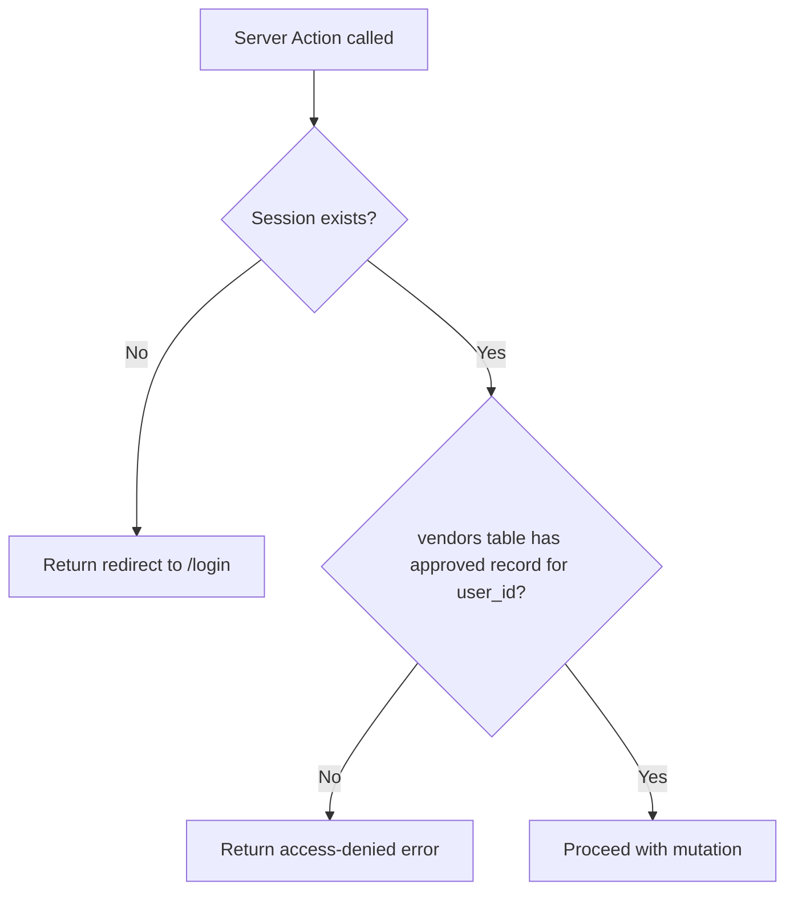

# Design Document: Collections Community Feature

## Overview

The Collections feature adds a community gallery to the Collector's Paradise Pokémon TCG event website. Approved vendors can post their card collections (title, description, images, price range, categories), and all visitors — including unauthenticated guests — can browse and view them.

The feature introduces the `/collections` route, replaces the "Experience" navbar link with "Collections", and provides vendors with a dashboard to manage their own listings. All data is persisted in Supabase with Row Level Security enforcing public reads and owner-only writes.

---

## Architecture

The feature follows Next.js App Router conventions with server components for data fetching, server actions for mutations, and client components only where interactivity is required.

```
app/
  collections/
    page.tsx              ← Public gallery (server component)
    [id]/
      page.tsx            ← Collection detail page (server component)
    new/
      page.tsx            ← Create collection form page (vendor only)
    [id]/
      edit/
        page.tsx          ← Edit collection form page (vendor only)
app/actions/
  collections.ts          ← All server actions
components/
  CollectionCard.tsx      ← Reusable gallery card (server or client)
  CollectionForm.tsx      ← Create/edit form with image upload (client)
```

### Data Flow

```mermaid
flowchart TD
    A[Visitor / Guest] -->|GET /collections| B[app/collections/page.tsx]
    B -->|getCollections()| C[app/actions/collections.ts]
    C -->|SELECT| D[(Supabase: collections table)]
    E[Vendor] -->|POST /collections/new| F[app/collections/new/page.tsx]
    F -->|checkVendorStatus()| C
    F -->|createCollection()| C
    C -->|INSERT| D
    C -->|upload images| G[(Supabase Storage: collection_images)]
```

### Auth & Authorization Flow



---

## Components and Interfaces

### `app/actions/collections.ts`

All data access and mutations are server actions. No direct Supabase calls from client components.

```typescript
// Types
export type Collection = {
  id: string;
  vendor_id: string;
  user_id: string;
  title: string;
  description: string;
  image_urls: string[];
  price_min: number;
  price_max: number;
  categories: string[];
  created_at: string;
  updated_at: string;
  vendor?: {
    business_name: string;
    logo_url: string | null;
  };
};

export type CollectionActionState = {
  success?: boolean;
  message?: string;
  errors?: Record<string, string[]>;
  data?: Collection;
};

// Read actions (no auth required)
export async function getCollections(): Promise<Collection[]>
export async function getCollectionById(id: string): Promise<Collection | null>

// Vendor-scoped read
export async function getVendorCollections(): Promise<Collection[]>

// Auth helper
export async function checkVendorStatus(): Promise<{ isVendor: boolean; vendorId?: string }>

// Mutations (vendor auth required)
export async function createCollection(
  prevState: CollectionActionState,
  formData: FormData
): Promise<CollectionActionState>

export async function updateCollection(
  id: string,
  prevState: CollectionActionState,
  formData: FormData
): Promise<CollectionActionState>

export async function deleteCollection(id: string): Promise<CollectionActionState>
```

**Vendor check pattern** (mirrors existing `vendors.ts` pattern):

```typescript
async function requireApprovedVendor(supabase: SupabaseClient) {
  const { data: { user } } = await supabase.auth.getUser();
  if (!user) return { error: 'unauthenticated' };

  const { data: vendor } = await supabase
    .from('vendors')
    .select('id')
    .eq('user_id', user.id)
    .eq('application_status', 'approved')
    .maybeSingle();

  if (!vendor) return { error: 'not_vendor' };
  return { user, vendor };
}
```

### `components/CollectionCard.tsx`

Renders a single collection summary in the gallery grid.

**Props:**
```typescript
type CollectionCardProps = {
  collection: Collection;
};
```

**Renders:** primary image, title, vendor business name, price range (e.g. `$20 – $500`), category pills, date posted.

**Behavior:** entire card is wrapped in a `<Link href="/collections/[id]">`.

### `components/CollectionForm.tsx`

Client component used for both create and edit flows.

**Props:**
```typescript
type CollectionFormProps = {
  initialData?: Collection;   // undefined = create mode, defined = edit mode
  vendorId: string;
};
```

**Fields:**
- `title` — text input, required
- `description` — textarea, required
- `images` — file input, 1–6 images, max 5MB each, image/* only
- `price_min` / `price_max` — number inputs, required, min <= max enforced client-side
- `categories` — multi-select checkboxes from `COLLECTION_CATEGORIES` constant

**Image upload flow:** files are uploaded to Supabase Storage from the client using the browser Supabase client before form submission. The resulting public URLs are passed as hidden fields to the server action.

### `app/collections/page.tsx`

Server component. Calls `getCollections()` and `checkVendorStatus()` in parallel. Renders:
- Page heading "COLLECTIONS" (Baloo font, uppercase)
- If vendor: "Post a Collection" button + Vendor Dashboard section (their collections count + list)
- Gallery grid of `<CollectionCard>` components
- Empty state if no collections

### `app/collections/[id]/page.tsx`

Server component. Calls `getCollectionById(id)`. Renders full detail view. Returns `notFound()` if collection doesn't exist.

### `app/collections/new/page.tsx`

Server component. Calls `checkVendorStatus()`. Redirects to `/login` if unauthenticated, shows access-denied if not a vendor. Renders `<CollectionForm>`.

### `app/collections/[id]/edit/page.tsx`

Server component. Calls `getCollectionById(id)` and `checkVendorStatus()`. Verifies ownership. Renders `<CollectionForm initialData={collection}>`.

---

## Data Models

### `collections` Table

```sql
-- Run this in your Supabase SQL Editor

-- 1. Create collections table
CREATE TABLE IF NOT EXISTS public.collections (
  id UUID DEFAULT gen_random_uuid() PRIMARY KEY,
  vendor_id UUID NOT NULL REFERENCES public.vendors(id) ON DELETE CASCADE,
  user_id UUID NOT NULL REFERENCES auth.users(id) ON DELETE CASCADE,
  title TEXT NOT NULL,
  description TEXT NOT NULL,
  image_urls TEXT[] NOT NULL DEFAULT '{}',
  price_min NUMERIC(10,2) NOT NULL,
  price_max NUMERIC(10,2) NOT NULL,
  categories TEXT[] NOT NULL DEFAULT '{}',
  created_at TIMESTAMPTZ DEFAULT NOW(),
  updated_at TIMESTAMPTZ DEFAULT NOW(),
  CONSTRAINT price_range_valid CHECK (price_min <= price_max)
);

-- 2. Updated_at trigger
CREATE OR REPLACE FUNCTION update_updated_at_column()
RETURNS TRIGGER AS $$
BEGIN NEW.updated_at = NOW(); RETURN NEW; END;
$$ language 'plpgsql';

CREATE TRIGGER update_collections_updated_at
  BEFORE UPDATE ON public.collections
  FOR EACH ROW EXECUTE FUNCTION update_updated_at_column();

-- 3. Indexes
CREATE INDEX IF NOT EXISTS idx_collections_vendor_id ON public.collections(vendor_id);
CREATE INDEX IF NOT EXISTS idx_collections_created_at ON public.collections(created_at DESC);

-- 4. Enable RLS
ALTER TABLE public.collections ENABLE ROW LEVEL SECURITY;

-- 5. RLS Policies
CREATE POLICY "Anyone can view collections"
  ON public.collections FOR SELECT USING (true);

CREATE POLICY "Vendors can insert their own collections"
  ON public.collections FOR INSERT
  WITH CHECK (auth.uid() = user_id);

CREATE POLICY "Vendors can update their own collections"
  ON public.collections FOR UPDATE
  USING (auth.uid() = user_id);

CREATE POLICY "Vendors can delete their own collections"
  ON public.collections FOR DELETE
  USING (auth.uid() = user_id);

-- 6. Storage bucket for collection images
INSERT INTO storage.buckets (id, name, public)
VALUES ('collection_images', 'collection_images', true)
ON CONFLICT (id) DO NOTHING;

-- 7. Storage policies
CREATE POLICY "Anyone can view collection images"
  ON storage.objects FOR SELECT
  USING (bucket_id = 'collection_images');

CREATE POLICY "Authenticated users can upload collection images"
  ON storage.objects FOR INSERT
  WITH CHECK (bucket_id = 'collection_images' AND auth.role() = 'authenticated');

CREATE POLICY "Users can delete their own collection images"
  ON storage.objects FOR DELETE
  USING (bucket_id = 'collection_images' AND auth.uid()::text = (storage.foldername(name))[1]);
```

### TypeScript Type (mirrors DB schema)

```typescript
export type Collection = {
  id: string;                 // UUID
  vendor_id: string;          // FK → vendors.id
  user_id: string;            // FK → auth.users.id
  title: string;
  description: string;
  image_urls: string[];       // public URLs from collection_images bucket
  price_min: number;          // NUMERIC(10,2)
  price_max: number;          // NUMERIC(10,2), >= price_min
  categories: string[];       // subset of COLLECTION_CATEGORIES
  created_at: string;         // ISO timestamp
  updated_at: string;         // ISO timestamp, auto-updated by trigger
};
```

### Predefined Categories Constant

```typescript
export const COLLECTION_CATEGORIES = [
  'Singles',
  'Booster Packs',
  'Sealed Products',
  'Graded Cards',
  'Vintage',
  'Modern',
  'Accessories',
] as const;
```

---

## Correctness Properties

*A property is a characteristic or behavior that should hold true across all valid executions of a system — essentially, a formal statement about what the system should do. Properties serve as the bridge between human-readable specifications and machine-verifiable correctness guarantees.*

### Property 1: Collection round-trip serialization

*For any* valid Collection object, inserting it into the database and then fetching it by ID should produce an object with all fields equivalent to the original input.

**Validates: Requirements 10.1, 10.5**

---

### Property 2: Gallery renders a card for every collection

*For any* non-empty list of Collections, rendering the gallery should produce exactly one `CollectionCard` per collection in the list — no cards are dropped or duplicated.

**Validates: Requirements 2.2**

---

### Property 3: CollectionCard displays all required fields

*For any* valid Collection, the rendered `CollectionCard` should contain the collection's title, vendor business name, price range, all categories as pill tags, and the date posted.

**Validates: Requirements 2.4, 8.3**

---

### Property 4: Collection detail page displays all required fields

*For any* valid Collection, the detail page render should contain all uploaded image URLs, the title, full description, vendor business name, vendor logo, price range, categories, and date posted.

**Validates: Requirements 3.2**

---

### Property 5: Invalid collection inputs are rejected with field errors

*For any* collection form submission missing one or more required fields (title, description, images, price_min, price_max, or categories), `createCollection` should return field-level validation errors and no record should be inserted into the database.

**Validates: Requirements 5.5**

---

### Property 6: Price constraint is enforced

*For any* collection where `price_min` is strictly greater than `price_max`, `createCollection` should return a validation error and no record should be inserted.

**Validates: Requirements 10.2**

---

### Property 7: Create collection round-trip

*For any* valid collection input submitted by an approved vendor, calling `createCollection` and then `getCollectionById` with the returned ID should produce a collection with all submitted field values preserved.

**Validates: Requirements 5.3**

---

### Property 8: Update collection round-trip

*For any* valid collection update submitted by the owning vendor, calling `updateCollection` and then `getCollectionById` should return a collection reflecting all updated field values, with `updated_at` strictly greater than `created_at`.

**Validates: Requirements 6.3, 10.3**

---

### Property 9: Non-owner cannot update a collection

*For any* collection and any authenticated user who is not the collection's owner, calling `updateCollection` should return an authorization error and the collection record should remain unchanged.

**Validates: Requirements 6.4, 10.4**

---

### Property 10: Delete removes collection from gallery

*For any* collection owned by a vendor, calling `deleteCollection` and then `getCollectionById` with the same ID should return `null` (not found), and the collection should no longer appear in `getCollections`.

**Validates: Requirements 7.2, 7.5**

---

### Property 11: Non-owner cannot delete a collection

*For any* collection and any authenticated user who is not the collection's owner, calling `deleteCollection` should return an authorization error and the collection record should remain in the database.

**Validates: Requirements 7.4, 10.4**

---

### Property 12: Vendor collections are isolated

*For any* approved vendor, `getVendorCollections` should return only collections where `vendor_id` matches that vendor's ID — no other vendor's collections should appear.

**Validates: Requirements 9.1**

---

### Property 13: Vendor collection count matches list length

*For any* approved vendor, the collection count displayed in the Vendor Dashboard should equal the length of the array returned by `getVendorCollections` for that vendor.

**Validates: Requirements 9.2**

---

### Property 14: Categories round-trip

*For any* non-empty subset of valid categories selected during collection creation, fetching the collection after creation should return the exact same set of categories.

**Validates: Requirements 8.2**

---

### Property 15: Edit form pre-populates with existing data

*For any* valid Collection, rendering the edit form with that collection as `initialData` should produce a form where every field's initial value matches the corresponding field in the collection.

**Validates: Requirements 6.2**

---

## Error Handling

| Scenario | Handling |
|---|---|
| Unauthenticated user accesses `/collections/new` | Server component redirects to `/login` |
| Authenticated non-vendor accesses `/collections/new` | Page renders access-denied message with explanation |
| Non-owner calls `updateCollection` or `deleteCollection` | Server action returns `{ message: 'Unauthorized' }` without mutating |
| Collection ID not found on detail page | `notFound()` renders Next.js 404 with link back to `/collections` |
| Image upload exceeds 5MB | Client-side validation rejects file before upload attempt |
| Non-image file uploaded | Client-side validation rejects file before upload attempt |
| Supabase storage upload fails | Server action returns `{ message: 'Image upload failed. Please try again.' }` |
| `price_min > price_max` submitted | Zod schema validation returns field error before DB insert |
| DB constraint violation (`price_range_valid`) | Caught and returned as user-facing error message |
| Missing required fields | Zod `safeParse` returns per-field errors, no DB call made |

---

## Testing Strategy

### Unit Tests (example-based)

Focus on specific behaviors and edge cases:

- Navbar renders "Collections" link and not "Experience"
- Empty gallery state renders empty-state message
- `CollectionCard` renders all required fields for a concrete collection fixture
- `CollectionForm` renders all required fields and predefined categories
- Unauthenticated `createCollection` call returns redirect error
- Non-vendor `createCollection` call returns access-denied error
- Image > 5MB is rejected client-side
- Non-image file is rejected client-side
- `getCollectionById` with non-existent ID returns `null`

### Property-Based Tests

Use **fast-check** (TypeScript PBT library) with a minimum of **100 iterations** per property.

Each test is tagged with a comment referencing the design property:
```
// Feature: collections, Property N: <property text>
```

Properties to implement as property-based tests (from Correctness Properties section):

| Property | Test approach |
|---|---|
| P1: Round-trip serialization | Generate random `Collection` objects, insert via mock, fetch, compare |
| P2: Gallery renders all cards | Generate random collection arrays, render gallery, count cards |
| P3: CollectionCard required fields | Generate random `Collection`, render card, assert all fields present |
| P4: Detail page required fields | Generate random `Collection`, render detail, assert all fields present |
| P5: Invalid inputs rejected | Generate random inputs with missing required fields, assert errors returned |
| P6: Price constraint enforced | Generate `price_min > price_max` pairs, assert validation error |
| P7: Create round-trip | Generate valid collection inputs, create + fetch, compare fields |
| P8: Update round-trip | Generate valid updates, update + fetch, compare fields + timestamps |
| P9: Non-owner update blocked | Generate collection + non-owner user, assert auth error + no mutation |
| P10: Delete removes collection | Generate collection, delete + fetch, assert null |
| P11: Non-owner delete blocked | Generate collection + non-owner user, assert auth error + record intact |
| P12: Vendor collections isolated | Generate multi-vendor scenario, assert each vendor sees only their own |
| P13: Count matches list length | Generate vendor with N collections, assert count === N |
| P14: Categories round-trip | Generate category subsets, create + fetch, assert same categories |
| P15: Edit form pre-populates | Generate `Collection`, render edit form, assert field values match |

### Integration Tests

- Submit a collection with real images and verify `image_urls` are populated with valid public URLs
- Delete a collection and verify associated images are removed from the `collection_images` storage bucket
- Verify RLS: unauthenticated Supabase client can SELECT but cannot INSERT/UPDATE/DELETE

### Design System Compliance

- Snapshot tests for `CollectionCard` and `CollectionForm` to catch unintended style regressions
- Verify `--color-cream` background, `--color-dark` text, 2px solid borders, and pill-style category tags are applied
